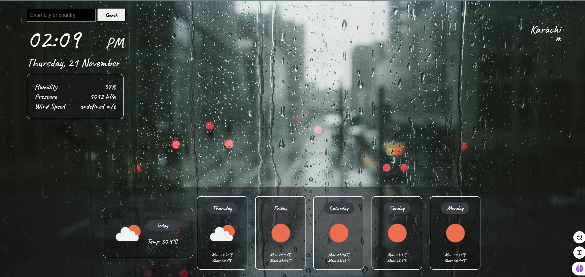

# Weather App

This is a simple weather application that fetches the current weather and a 5-day forecast using the OpenWeather API. You can search for weather information by entering a city or country name.

## Features
- **Current weather**: Displays temperature, humidity, pressure, and wind speed.
- **5-day forecast**: Shows the weather forecast for the next 5 days (at 12:00 PM for each day).
- **Search functionality**: Allows you to search by city name or country code.

## Technologies Used
- **HTML5**: For structure and layout.
- **CSS**: For styling the app.
- **JavaScript**: For functionality and making API calls.
- **OpenWeather API**: To get weather data.
- **Moment.js**: To manage time and date formatting.


## Setup Instructions

1. **Clone the repository** to your local machine:
   ```bash
   git clone https://github.com/unza730/weather-app
   ```

2. **Install dependencies**: If you're working with any JavaScript libraries (like Moment.js), make sure you include them by using a CDN or by installing via npm. You can include them in your HTML `<script>` tags.

3. **Add your API key**: You need an OpenWeather API key to get weather data. Replace the placeholder in the `index.js` file:
   ```javascript
   const API_KEY = 'your_api_key_here';
   ```
   You can get your API key from [OpenWeather](https://openweathermap.org/).

4. **Run the application**: Open the `index.html` file in your browser.

## File Structure
```bash
/WeatherApp
  ├── index.html        # Main HTML file
  ├── index.css         # Styles for the app
  ├── index.js          # JavaScript file for weather functionality
  ├── assets/           # Folder containing images and other assets
  │   └── weather-app-screenshot.png  # Screenshot of the app
  └── README.md         # This file
```

## How to Use
1. Enter a city or country name in the search bar.
2. Click the **Search** button to fetch the weather data.
3. The current weather and 5-day forecast will be displayed.

---

### Notes:
- The syntax `` is used to embed images in Markdown. The "Alt text" is a description of the image, and the path should be relative to the README file location.
- Ensure that the screenshot path (`assets/weather-app-screenshot.png`) matches the folder and file name in your project.

## Screenshot
Here’s a screenshot of the Weather App in action:
